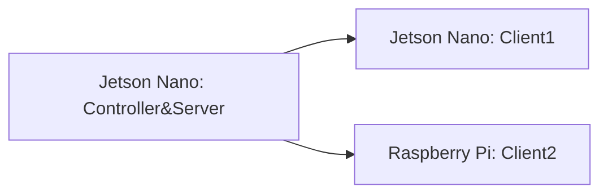

# Federated Learning Platform - version 1.0

# Background

本项目主要是对之前[fl-experiment](https://github.com/MyStarNight/fl-experiment)的扩展。

目前fl-experiment项目经过多次迭代，已经趋于稳定。

项目内容为使用10个Raspi进行Federated Learning训练。

在此之后，项目组又获得了8快Jetson Nano，因此打算重新构建完整的**Federated Learning Platform**。

# Direction 

## Topology

当前项目仍然利用`pysyft`去进行联邦学习的构建。

选择合适的拓扑结构，进行Decentralized Federated Learning。

目前构建的是Partially Connected Network中的star structure。


## Heterogeneous Devices

Raspi 4B的CPU是Cortex-A72，而Jetson Nano的CPU是Cortex-A57。

从CPU上来说Nano是没有Raspi性能好的，但是Nano可以调用CUDA。

在这个项目中做到设备的异构，让Nano使用CUDA进行训练。

# Implementation

在当前版本中，主要使用了三个IoT设备去完成异构训练。

## Device

- Jetson Nano * 2 (use cuda)
- Raspi * 1
- Ubuntu Laptop

| Device        | Role                  | Host         | Port | use_cuda | id      |
| ------------- | --------------------- | ------------ | ---- | -------- | ------- |
| Jetson Nano   | Controller and Server | 192.168.3.15 | 9292 | True     | \       |
| Jetson Nano   | Client1               | 192.168.3.5  | 9292 | True     | A       |
| Raspberry Pi  | Client2               | 192.168.3.4  | 9292 | False    | B       |
| Ubuntu Laptop | Testing               | 192.168.3.17 | 9292 | False    | testing |


## Topology



- Controller: 选择一个Jetson Nano 作为Controller，用来连接参与训练的客户端。
- Client: 选择两个异构设备进行训练，Jetson Nano可以调用CUDA，当作强设备使用；Raspberry Pi作为弱设备使用。

## Command

jetson nano client1:

```bash
cd /home/hao/work/fl-pj/fl-test/; python run_websocket_server.py --id A
```

raspberry pi client2:

```bash
cd /home/pi/work/fl-pj/fl-test/; python run_websocket_server.py --id B
```

ubuntu laptop testing:

```bash
cd /home/hao/work/fl-pj/fl-test/; python run_websocket_server.py --testing --id testing
```

jetson nano controller&server:

```bash
cd /home/hao/work/fl-pj/federated-learning-platform; python run_websocket_client.py
```

