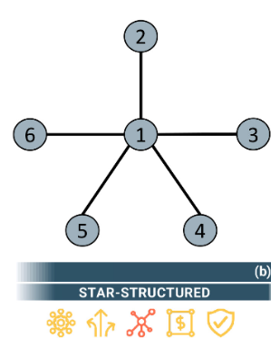
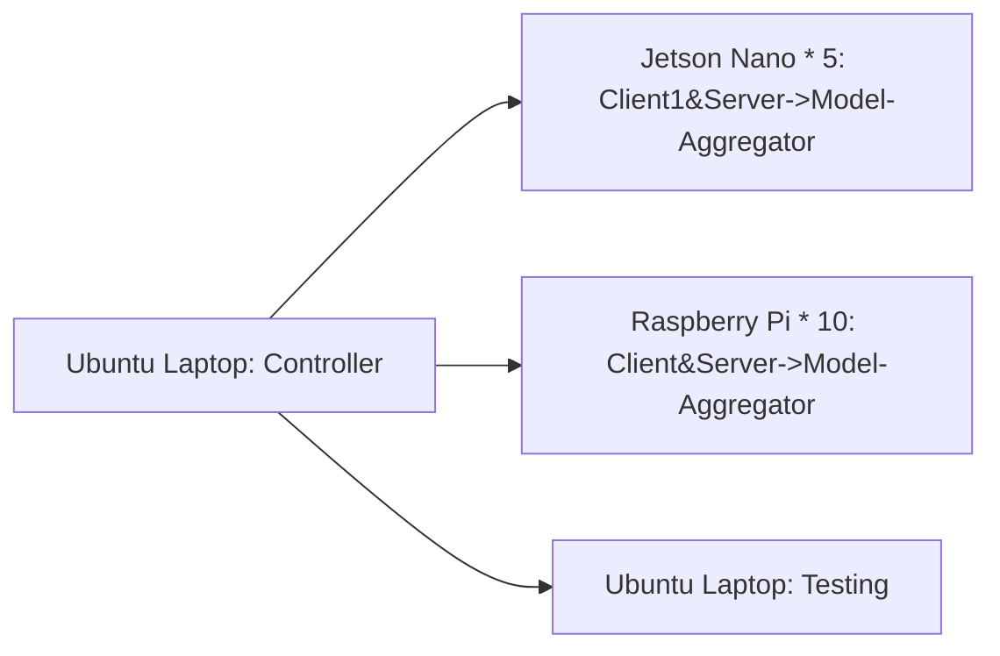

# Federated Learning Platform - version 2.0

# Background

本项目主要是对之前[fl-experiment](https://github.com/MyStarNight/fl-experiment)的扩展。

目前fl-experiment项目经过多次迭代，已经趋于稳定。

项目内容为使用10个Raspi进行Federated Learning训练。

在此之后，项目组又获得了8块Jetson Nano，因此打算重新构建完整的**Federated Learning Platform**。

# Direction 

## Topology

当前项目仍然利用`pysyft`去进行联邦学习的构建。

选择合适的拓扑结构，进行Decentralized Federated Learning。

目前构建的是Partially Connected Network中的star structure。



## Heterogeneous Devices

Raspi 4B的CPU是Cortex-A72，而Jetson Nano的CPU是Cortex-A57。

从CPU上来说Nano是没有Raspi性能好的，但是Nano可以调用CUDA。

在这个项目中做到设备的异构，让Nano使用CUDA进行训练。

# Updating

version3.0作出了以下调整：

- 将联邦学习平台由2台IoT设备扩展到**15台IoT设备（10 raspi ， 5 nano）**
- 聚合设备在选择时，使用的是**按照顺序依次选择设备**作为model aggregator
- 增加了Server**掉线机制**，如果模型聚合设备掉线，会自动转移到下一个聚合设备上

Benefits：

- 实现了不同IoT设备之间的异构训练
- 对聚合节点使用了去中心化机制，自动选择可获得节点进行模型聚合

# Implementation

## Device

- Jetson Nano * 5(use cuda)
- Raspi * 10
- Ubuntu Laptop

```python
client_device_mapping_id = {
    "192.168.3.2": "A",
    "192.168.3.3": "B",
    "192.168.3.4": "C",
    "192.168.3.7": "D",
    "192.168.3.8": "E",
    "192.168.3.10": "F",
    "192.168.3.11": "G",
    "192.168.3.12": "H",
    "192.168.3.13": "I",
    "192.168.3.20": "J",
    "192.168.3.5": "AA",
    "192.168.3.6": "BB",
    "192.168.3.9": "CC",
    "192.168.3.15": "DD",
    "192.168.3.16": "EE",
    "192.168.3.17": "testing"
}
```

## Topology



- Controller: 选择Ubuntu Laptop 作为Controller，用来连接参与训练的客户端；值得一提的是，Ubuntu Laptop上面**没有进行任何训练的计算**，其作用仅仅是作为通信的中心节点以及对训练进行规划。
- Client\Server(Model Aggregator): 选择两种异构设备，Jetson Nano可以调用CUDA，当作强设备使用；Raspberry Pi作为弱设备使用。在这15个设备中，既可以作为联邦设备Server的中心节点，也可以作为client训练设备。

## Command

jetson nano:

```bash
conda activate fl2; cd /home/hao/work/fl-pj/federated-learning-platform; python run_websocket_server.py
```

raspberry pi:

```bash
cd /home/pi/work/fl-pj/federated-learning-platform; python run_websocket_server.py
```

ubuntu laptop testing:

```bash
conda activate fl; cd /home/hao/work/fl-pj/federated-learning-platform; python run_websocket_server.py --testing
```

ubuntu laptop controller&server:

```bash
conda activate fl; cd /home/hao/work/fl-pj/federated-learning-platform; python run_websocket_client.py
```
