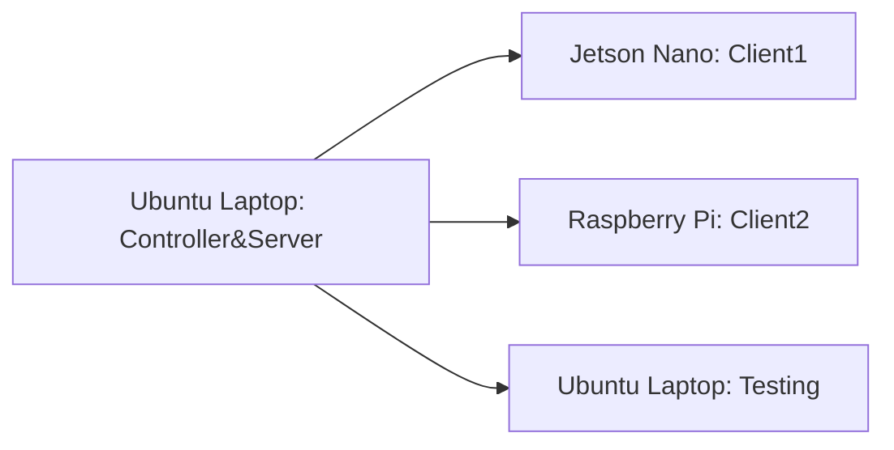

# Federated Learning Platform - version 1.1

# Background

本项目主要是对之前[fl-experiment](https://github.com/MyStarNight/fl-experiment)的扩展。

目前fl-experiment项目经过多次迭代，已经趋于稳定。

项目内容为使用10个Raspi进行Federated Learning训练。

在此之后，项目组又获得了8块Jetson Nano，因此打算重新构建完整的**Federated Learning Platform**。

# Direction 

## Topology

当前项目仍然利用`pysyft`去进行联邦学习的构建。

选择合适的拓扑结构，进行Decentralized Federated Learning。

目前构建的是Partially Connected Network中的star structure。


## Heterogeneous Devices

Raspi 4B的CPU是Cortex-A72，而Jetson Nano的CPU是Cortex-A57。

从CPU上来说Nano是没有Raspi性能好的，但是Nano可以调用CUDA。

在这个项目中做到设备的异构，让Nano使用CUDA进行训练。

# Updating

相较于version1.0，1.1作出了以下调整：

- Server&Controller&Testing由Ubuntu Laptop代替

- 使用了两个IoT设备，一个Jetson Nano，一个Raspberry Pi

Benefits：

- 将Jetson Nano作为star structure的中心节点很有可能，存在算力不足的情况；毕竟最终版本是希望能够操控10+台设备。
- 对于可以使用cuda的设备，可以自己去调用训练设备的cuda；不需要手动设置了，大大加快了训练的时间

# Implementation

在当前版本中，主要使用了两个IoT设备去完成异构训练。

## Device

- Jetson Nano * 1(use cuda)
- Raspi * 1
- Ubuntu Laptop

| Device        | Role                      | Host         | Port | use_cuda | id      |
| ------------- | ------------------------- | ------------ | ---- | -------- | ------- |
| Ubuntu Laptop | Controller\Server\Testing | 192.168.3.15 | 9292 | True     | Testing |
| Jetson Nano   | Client1                   | 192.168.3.5  | 9292 | True     | A       |
| Raspberry Pi  | Client2                   | 192.168.3.4  | 9292 | False    | B       |

## Topology



- Controller: 选择Ubuntu Laptop 作为Controller，用来连接参与训练的客户端。
- Client: 选择两个异构设备进行训练，Jetson Nano可以调用CUDA，当作强设备使用；Raspberry Pi作为弱设备使用。

## Command

jetson nano client1:

```bash
cd /home/hao/work/fl-pj/fl-test2/; python run_websocket_server.py --id A
```

raspberry pi client2:

```bash
cd /home/pi/work/fl-pj/fl-test2/; python run_websocket_server.py --id B
```

ubuntu laptop testing:

```bash
cd /home/hao/work/fl-pj/fl-test2/; python run_websocket_server.py --testing --id testing
```

ubuntu laptop controller&server:

```bash
cd /home/hao/work/fl-pj/Federated-Learning-Platform/; python run_websocket_client.py
```

# Experiment Result

From Ubuntu Server&Controller

```
2024-02-28 12:19:24,370 | Training round 1/5
User-A Federated Learning start time: 2024-02-28 12:19:24.371127
User-B Federated Learning start time: 2024-02-28 12:19:25.029643
User-A Federated Learning end time: 2024-02-28 12:19:30.187185
User-B Federated Learning end time: 2024-02-28 12:19:33.814263
2024-02-28 12:19:33,814 | Evaluating models
2024-02-28 12:19:34,271 | Model update A: Average loss: 0.0599, Accuracy: 223/1080 (20.65%)
2024-02-28 12:19:34,786 | Model update B: Average loss: 0.0598, Accuracy: 199/1080 (18.43%)
2024-02-28 12:19:35,334 | Target histogram: [ 0  240  250  271  121  92  106]
2024-02-28 12:19:35,334 | Federated model: Average loss: 0.0159, Accuracy: 214/1080 (19.81%)
2024-02-28 12:19:35,334 | Training round 2/5
User-A Federated Learning start time: 2024-02-28 12:19:35.334425
User-B Federated Learning start time: 2024-02-28 12:19:36.249093
User-A Federated Learning end time: 2024-02-28 12:19:41.448550
User-B Federated Learning end time: 2024-02-28 12:19:46.461549
2024-02-28 12:19:46,507 | Training round 3/5
User-A Federated Learning start time: 2024-02-28 12:19:46.507876
User-B Federated Learning start time: 2024-02-28 12:19:47.143307
User-A Federated Learning end time: 2024-02-28 12:19:52.153822
User-B Federated Learning end time: 2024-02-28 12:19:55.793442
2024-02-28 12:19:55,839 | Training round 4/5
User-A Federated Learning start time: 2024-02-28 12:19:55.839902
User-B Federated Learning start time: 2024-02-28 12:19:56.470987
User-A Federated Learning end time: 2024-02-28 12:20:01.321976
User-B Federated Learning end time: 2024-02-28 12:20:04.911995
2024-02-28 12:20:04,963 | Training round 5/5
User-A Federated Learning start time: 2024-02-28 12:20:04.964157
User-B Federated Learning start time: 2024-02-28 12:20:05.568121
User-A Federated Learning end time: 2024-02-28 12:20:10.502200
User-B Federated Learning end time: 2024-02-28 12:20:14.234073
2024-02-28 12:20:14,234 | Evaluating models
2024-02-28 12:20:14,605 | Model update A: Average loss: 0.0549, Accuracy: 437/1080 (40.46%)
2024-02-28 12:20:15,001 | Model update B: Average loss: 0.0549, Accuracy: 432/1080 (40.00%)
2024-02-28 12:20:15,533 | Target histogram: [ 0  240  250  271  121  92  106]
2024-02-28 12:20:15,533 | Federated model: Average loss: 0.0146, Accuracy: 435/1080 (40.28%)
```

From Jetson Nano Client1

```
cuda is available.
Training start time: 2024-02-28 12:19:25.764873
Training end time: 2024-02-28 12:19:26.448161
Time Consuming: 0.683288
cuda is available.
Training start time: 2024-02-28 12:19:37.030674
Training end time: 2024-02-28 12:19:37.729933
Time Consuming: 0.699259
cuda is available.
Training start time: 2024-02-28 12:19:47.856005
Training end time: 2024-02-28 12:19:48.430059
Time Consuming: 0.574054
cuda is available.
Training start time: 2024-02-28 12:19:57.127621
Training end time: 2024-02-28 12:19:57.625923
Time Consuming: 0.498302
cuda is available.
Training start time: 2024-02-28 12:20:06.252529
Training end time: 2024-02-28 12:20:06.774596
Time Consuming: 0.522067
```

From Raspberry Pi Client2

```
cpu is available.
Training start time: 2024-02-28 12:19:25.701126
Training end time: 2024-02-28 12:19:29.674205
Time Consuming: 3.973079
cpu is available.
Training start time: 2024-02-28 12:19:36.957980
Training end time: 2024-02-28 12:19:42.718705
Time Consuming: 5.760725
cpu is available.
Training start time: 2024-02-28 12:19:47.786251
Training end time: 2024-02-28 12:19:51.861176
Time Consuming: 4.074925
cpu is available.
Training start time: 2024-02-28 12:19:57.057464
Training end time: 2024-02-28 12:20:01.192892
Time Consuming: 4.135428
cpu is available.
Training start time: 2024-02-28 12:20:06.182308
Training end time: 2024-02-28 12:20:10.490815
Time Consuming: 4.308507
```

可以看到，单纯从训练时间来看，Jetson Nano训练比树莓派更快，耗时更短。
