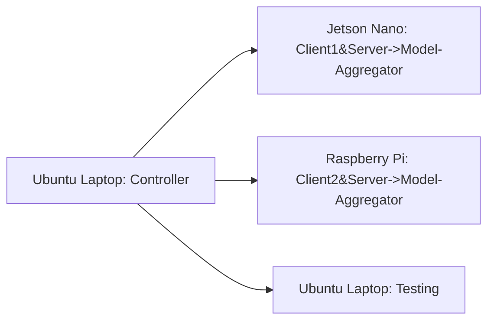

# Federated Learning Platform - version 2.0

# Background

本项目主要是对之前[fl-experiment](https://github.com/MyStarNight/fl-experiment)的扩展。

目前fl-experiment项目经过多次迭代，已经趋于稳定。

项目内容为使用10个Raspi进行Federated Learning训练。

在此之后，项目组又获得了8块Jetson Nano，因此打算重新构建完整的**Federated Learning Platform**。

# Direction 

## Topology

当前项目仍然利用`pysyft`去进行联邦学习的构建。

选择合适的拓扑结构，进行Decentralized Federated Learning。

目前构建的是Partially Connected Network中的star structure。


## Heterogeneous Devices

Raspi 4B的CPU是Cortex-A72，而Jetson Nano的CPU是Cortex-A57。

从CPU上来说Nano是没有Raspi性能好的，但是Nano可以调用CUDA。

在这个项目中做到设备的异构，让Nano使用CUDA进行训练。

# Updating

version2.0作出了以下调整：

- 实现了联邦学习的去中心化，可以在边缘节点实现模型的聚合。

Benefits：

- 可以拥有多个Server（模型聚合点），更加可靠。

# Implementation

在当前版本中，主要使用了两个IoT设备去完成异构训练。

## Device

- Jetson Nano * 1(use cuda)
- Raspi * 1
- Ubuntu Laptop

| Device        | Role                             | Host         | Port | use_cuda | id      |
| ------------- | -------------------------------- | ------------ | ---- | -------- | ------- |
| Ubuntu Laptop | Controller\Testing               | 192.168.3.15 | 9292 | True     | Testing |
| Jetson Nano   | Client1\Server(Model Aggregator) | 192.168.3.5  | 9292 | True     | A       |
| Raspberry Pi  | Client2\Server(Model Aggregator) | 192.168.3.4  | 9292 | False    | B       |

## Topology



- Controller: 选择Ubuntu Laptop 作为Controller，用来连接参与训练的客户端；值得一提的是，Ubuntu Laptop上面**没有进行任何训练的计算**，其作用仅仅是作为通信的中心节点以及对训练进行规划。
- Client\Server(Model Aggregator): 选择两个异构设备，Jetson Nano可以调用CUDA，当作强设备使用；Raspberry Pi作为弱设备使用。在这两个设备中，既可以作为联邦设备Server的中心节点，也可以作为client训练设备。

## Command

jetson nano client1:

```bash
cd /home/hao/work/fl-pj/fl-test3/; python run_websocket_server.py --id A
```

raspberry pi client2:

```bash
cd /home/pi/work/fl-pj/fl-test3/; python run_websocket_server.py --id B
```

ubuntu laptop testing:

```bash
cd /home/hao/work/fl-pj/fl-test3/; python run_websocket_server.py --testing --id testing
```

ubuntu laptop controller&server:

```bash
cd /home/hao/work/fl-pj/Federated-Learning-Platform/; python run_websocket_client.py
```

# Experiment Result

From Ubuntu Server&Controller

```
python run_websocket_client.py
2024-02-29 22:30:49,986 | Training round 1/5
User-A Federated Learning start time: 2024-02-29 22:30:49.986805
User-B Federated Learning start time: 2024-02-29 22:30:50.686360
User-B Federated Learning end time: 2024-02-29 22:30:59.324004
User-A Federated Learning end time: 2024-02-29 22:31:09.252735
2024-02-29 22:31:09,252 | Evaluating models
2024-02-29 22:31:09,636 | Model update A: Average loss: 0.0584, Accuracy: 241/1080 (22.31%)
2024-02-29 22:31:10,083 | Model update B: Average loss: 0.0573, Accuracy: 453/1080 (41.94%)
Model Aggregation on device: A
{'ID': 15172146657, 'model_id_list': (1, (96467058388, 57217871679)), 'federated_model_id': 24219414938}
2024-02-29 22:31:23,314 | Target histogram: [ 0  240  250  271  121  92  106]
2024-02-29 22:31:23,315 | Federated model: Average loss: 0.0153, Accuracy: 365/1080 (33.80%)
2024-02-29 22:31:23,315 | Training round 2/5
User-A Federated Learning start time: 2024-02-29 22:31:23.315575
User-B Federated Learning start time: 2024-02-29 22:31:23.953045
User-A Federated Learning end time: 2024-02-29 22:31:28.717744
User-B Federated Learning end time: 2024-02-29 22:31:32.387099
Model Aggregation on device: B
{'ID': 21358797425, 'model_id_list': (1, (70755797568, 26945085726)), 'federated_model_id': 66069631212}
2024-02-29 22:31:45,187 | Training round 3/5
User-A Federated Learning start time: 2024-02-29 22:31:45.188100
User-B Federated Learning start time: 2024-02-29 22:31:45.801571
User-A Federated Learning end time: 2024-02-29 22:31:50.597378
User-B Federated Learning end time: 2024-02-29 22:31:54.162311
Model Aggregation on device: A
{'ID': 21831433183, 'model_id_list': (1, (65433892514, 19428589997)), 'federated_model_id': 20025083924}
2024-02-29 22:32:06,849 | Training round 4/5
User-A Federated Learning start time: 2024-02-29 22:32:06.849776
User-B Federated Learning start time: 2024-02-29 22:32:07.440548
User-A Federated Learning end time: 2024-02-29 22:32:12.337988
User-B Federated Learning end time: 2024-02-29 22:32:15.913757
Model Aggregation on device: B
{'ID': 44537332751, 'model_id_list': (1, (46278041683, 29060044220)), 'federated_model_id': 82517621847}
2024-02-29 22:32:28,728 | Training round 5/5
User-A Federated Learning start time: 2024-02-29 22:32:28.728486
User-B Federated Learning start time: 2024-02-29 22:32:29.314385
User-A Federated Learning end time: 2024-02-29 22:32:34.267033
User-B Federated Learning end time: 2024-02-29 22:32:37.874173
2024-02-29 22:32:37,874 | Evaluating models
2024-02-29 22:32:38,265 | Model update A: Average loss: 0.0521, Accuracy: 442/1080 (40.93%)
2024-02-29 22:32:38,733 | Model update B: Average loss: 0.0517, Accuracy: 442/1080 (40.93%)
Model Aggregation on device: A
{'ID': 35212635746, 'model_id_list': (1, (45010139592, 65763824346)), 'federated_model_id': 61213038491}
2024-02-29 22:32:51,816 | Target histogram: [ 0  240  250  271  121  92  106]
2024-02-29 22:32:51,817 | Federated model: Average loss: 0.0138, Accuracy: 442/1080 (40.93%)

```

From Jetson Nano Client1

```
cuda is available.
Training start time: 2024-02-29 22:31:03.696876
Training end time: 2024-02-29 22:31:05.510812
Time Consuming: 1.813936

Aggregate object is Okay.
Aggregating start time: 2024-02-29 22:31:11.875931
cuda is available.
Aggregating end time: 2024-02-29 22:31:12.326040
Time Consuming: 0.450109

cuda is available.
Training start time: 2024-02-29 22:31:24.664888
Training end time: 2024-02-29 22:31:25.060833
Time Consuming: 0.395945

cuda is available.
Training start time: 2024-02-29 22:31:46.481397
Training end time: 2024-02-29 22:31:46.931495
Time Consuming: 0.450098

Aggregate object is Okay.
Aggregating start time: 2024-02-29 22:31:55.846301
cuda is available.
Aggregating end time: 2024-02-29 22:31:56.294941
Time Consuming: 0.44864

cuda is available.
Training start time: 2024-02-29 22:32:08.139833
Training end time: 2024-02-29 22:32:08.636824
Time Consuming: 0.496991

cuda is available.
Training start time: 2024-02-29 22:32:30.007708
Training end time: 2024-02-29 22:32:30.595781
Time Consuming: 0.588073

Aggregate object is Okay.
Aggregating start time: 2024-02-29 22:32:40.482169
cuda is available.
Aggregating end time: 2024-02-29 22:32:40.924660
Time Consuming: 0.442491
```

From Raspberry Pi Client2

```
cpu is available.
Training start time: 2024-02-29 22:30:51.442832
Training end time: 2024-02-29 22:30:55.606132
Time Consuming: 4.1633

cpu is available.
Training start time: 2024-02-29 22:31:24.595942
Training end time: 2024-02-29 22:31:28.680664
Time Consuming: 4.084722

Aggregate object is Okay.
Aggregating start time: 2024-02-29 22:31:33.950584
cpu is available.
Aggregating end time: 2024-02-29 22:31:34.303971
Time Consuming: 0.353387

cpu is available.
Training start time: 2024-02-29 22:31:46.416492
Training end time: 2024-02-29 22:31:50.380146
Time Consuming: 3.963654

cpu is available.
Training start time: 2024-02-29 22:32:08.081533
Training end time: 2024-02-29 22:32:12.103012
Time Consuming: 4.021479

Aggregate object is Okay.
Aggregating start time: 2024-02-29 22:32:17.523431
cpu is available.
Aggregating end time: 2024-02-29 22:32:17.902160
Time Consuming: 0.378729

cpu is available.
Training start time: 2024-02-29 22:32:29.941971
Training end time: 2024-02-29 22:32:34.103786
Time Consuming: 4.161815
```

可以看到，单纯从训练时间来看，Jetson Nano训练比树莓派更快，耗时更短；聚合时间上，目前树莓派稍快于Nano。
